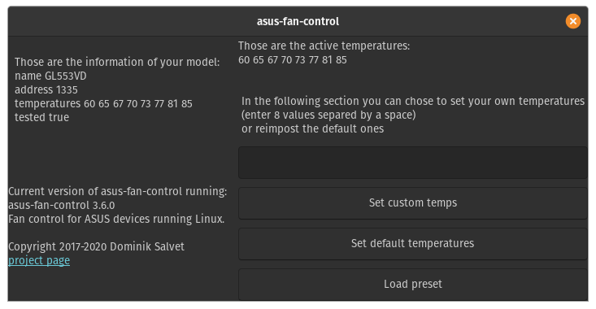

# afc-gui
GUI for the asus-fan-control project

For the testing the file is testing.py and does not require asus-fan-control, only downloadable using:`git clone https://github.com/Greifent/afc-gui.git`

# Dependency:
* asus-fan-control installed
* python3.7
* Reported issue with UBUNTU 18.04 LTS, currently working on it. [issue](https://github.com/Greifent/afc-gui/issues/10)

# Installation:
 * Using [GitPack](https://github.com/dominiksalvet/gitpack): `gitpack install https://github.com/Greifent/afc-gui.git`, then just type in the terminal `afc-gui`.
 
 * Using git clone: `git clone https://github.com/Greifent/afc-gui.git`, navigate to the cloned directory, execute the afc-gui
 
# Photo:

This is the main window

