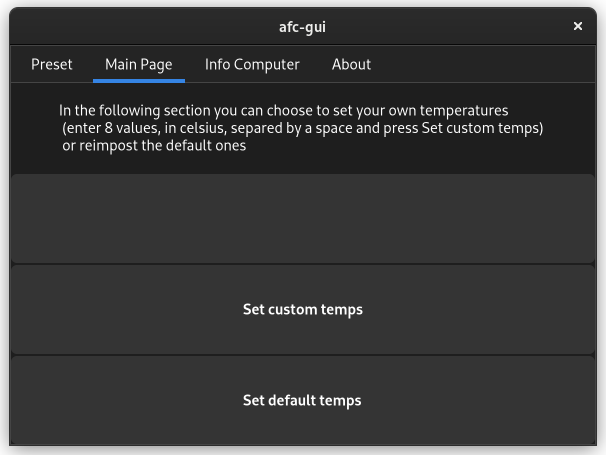

# afc-gui
GUI for the asus-fan-control project

# Dependency:
* asus-fan-control installed
* python3
* For the current CPU temperature CPU-temperature-monitor is required, you can install it via `sudo pip3 install CPU-temperature-monitor`.

# Installation:
 * If you have a previous version installed delete afc-gui and MAINGUI.glade from ~/.local/bin/ and then install using one of the methods below

 * Using [GitPack](https://github.com/dominiksalvet/gitpack): `sudo gitpack install https://github.com/Greifent/afc-gui.git`, then just type in the terminal `afc-gui` or look for afc-gui in your launcher.

 * Using git clone: `git clone https://github.com/Greifent/afc-gui.git`, navigate afc-gui/prgm/, move afc-gui to `/usr/bin/` the MAINGUI.glade to `/usr/share/afc-gui` (you will have to create the afc-gui folder) and afc-gui.desktop to `/usr/share/applications/`, execute the afc-gui or look for afc-gui in the launcher of your distribution

# Photo:

This is the preset page

This is the main page

This is the info page

This is the about page

