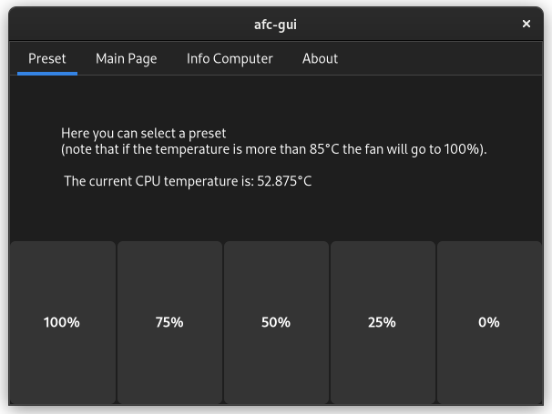
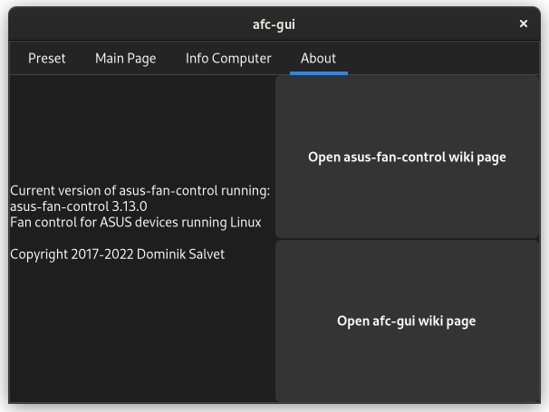

# afc-gui
GUI for the asus-fan-control project

# Dependency:
* asus-fan-control installed
* python3

# Installation:
 * If you have a previous version installed delete afc-gui and MAINGUI.glade from ~/.local/bin/ and then install using one of the methods below

 * Using [GitPack](https://github.com/dominiksalvet/gitpack): `sudo gitpack install https://github.com/Greifent/afc-gui.git`, then just type in the terminal `afc-gui` or look for afc-gui in your launcher.

 * Manual installation:
 
To install just run these commands
```
git clone https://github.com/Greifent/afc-gui.git
cd afc-gui/src/
sudo cp afc-gui /usr/bin/
sudo mkdir /usr/share/afc-gui
sudo cp afc-gui-gtk4.ui /usr/share/afc-gui/
sudo cp afc-gui.desktop /usr/share/applications/
```
To uninstall these:
```
sudo rm /usr/bin/afc-gui
sudo rm -r /usr/share/afc-gui/
sudo rm /usr/share/applications/afc-gui.desktop
```
To update the version run the uninstall commands, then the install ones.

# Photo:

This is the preset page



This is the main page


This is the info page


This is the about page


